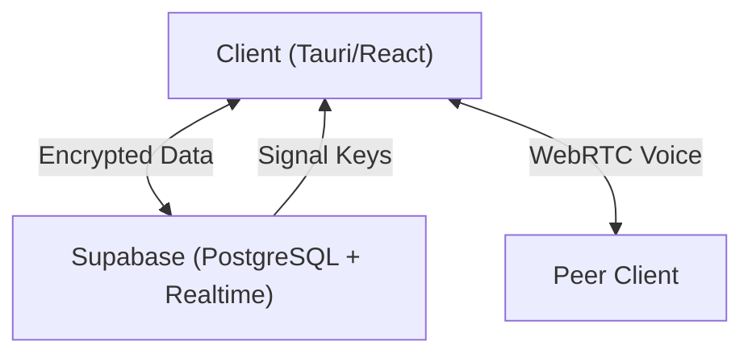

# Yapper Architecture 🏗️

## High-Level Overview

Yapper follows a **"Thick Client, Thin Server"** architecture. The server (Supabase) acts primarily as a dumb relay and storage for encrypted blobs. All business logic, decryption, and key management happen on the client device.

## 🔐 Security Model (Zero-Knowledge)

### 1. The Signal Protocol

We utilize the **Signal Protocol** for asynchronous messaging.

- **X3DH (Extended Triple Diffie-Hellman)**: For establishing initial shared secrets between users.
- **Double Ratchet Algorithm**: For encrypting individual messages with forward secrecy (if a key is compromised, past messages remain secure).

### 2. Identity Keys

- Generated locally on first launch/login (`lib/e2ee.ts`).
- Stored in `localStorage` (persisted via `PersistentSignalProtocolStore`).
- Public keys are uploaded to `profiles` table in Supabase.
- Private keys **NEVER** leave the device.

### 3. Message Flow

1. **Alice** wants to message **Bob**.
2. Alice fetches Bob's **Signed PreKey** and **Identity Key** from Supabase.
3. Alice initiates a Signal Session and encrypts the message: `ciphertext = Encrypt(message, Bob's Key)`.
4. Alice upholds **Self-Visibility** by also encrypting the message for herself (different session).
5. The `ciphertext` is uploaded to `public.messages`.
6. Bob receives a realtime event, downloads the `ciphertext`, and decrypts it locally.

## 🛠️ Technology Stack

- **Frontend**: React 19, Vite, Tailwind CSS v4
- **Runtime**: Tauri v2 (Rust) for Desktop, Browser for Web
- **Backend**: Supabase (PostgreSQL 15, GoTrue Auth, Realtime)
- **Voice**: WebRTC (Mesh Topology, no SFU yet)
- **Testing**: Vitest (Unit), Playwright (E2E)

## 📂 Database Schema

### `profiles`

User identities. Publicly readable, writeable only by self.

- `id` (UUID, PK)
- `username` (Text)
- `avatar_url` (Text)
- `public_identity_key` (Text, Base64)
- `signed_pre_key` (JSONB)

### `messages`

Encrypted payloads.

- `id` (UUID, PK)
- `content` (Text, Encrypted Base64)
- `nonce` (Text, IV/Metadata)
- `user_id` (Sender)
- `thread_id` (Context)

## 🔄 CI/CD Pipeline

We use **GitHub Actions** for:

1. **Linting**: ESLint checks.
2. **Unit Tests**: Vitest runs for crypto logic.
3. **E2E Tests**: Playwright runs against a local dev server.
4. **Build**: Vite build to verify production readiness.
